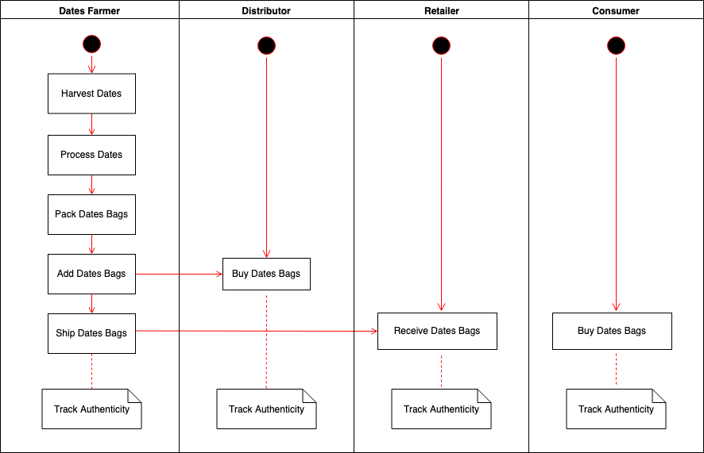
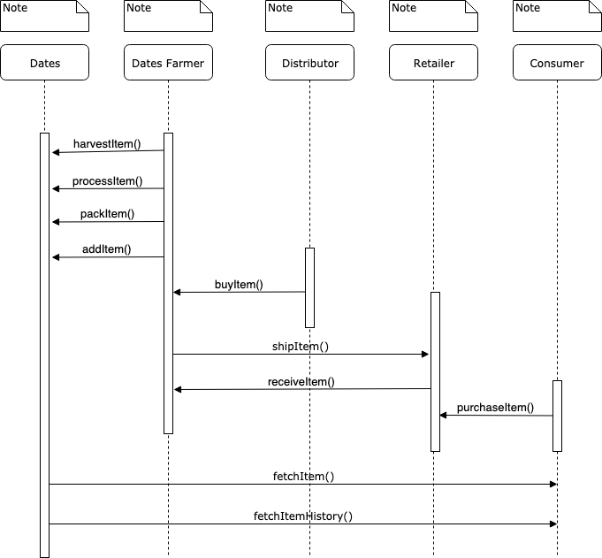
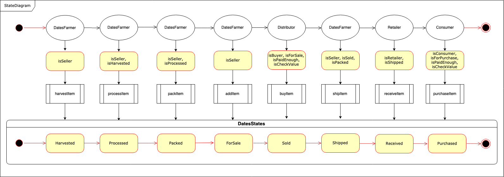
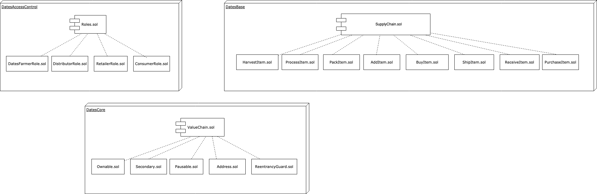
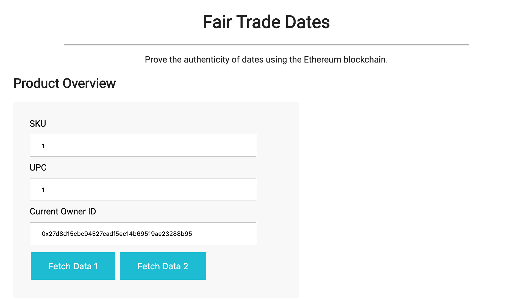
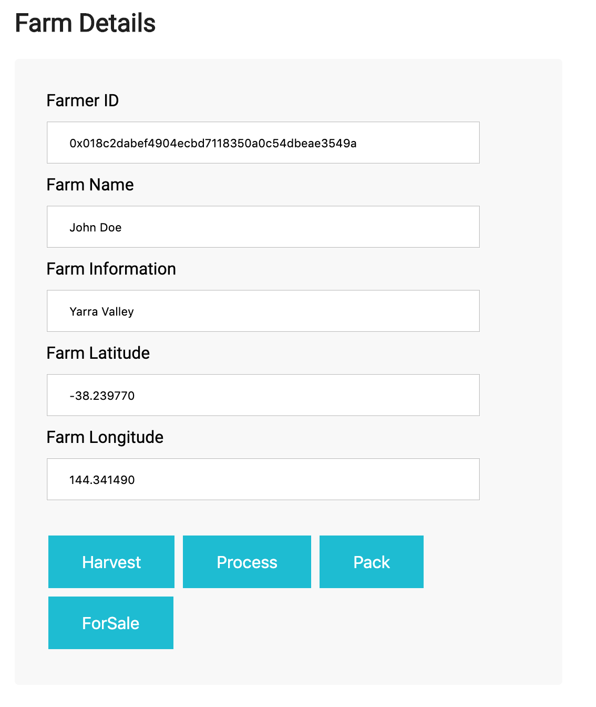
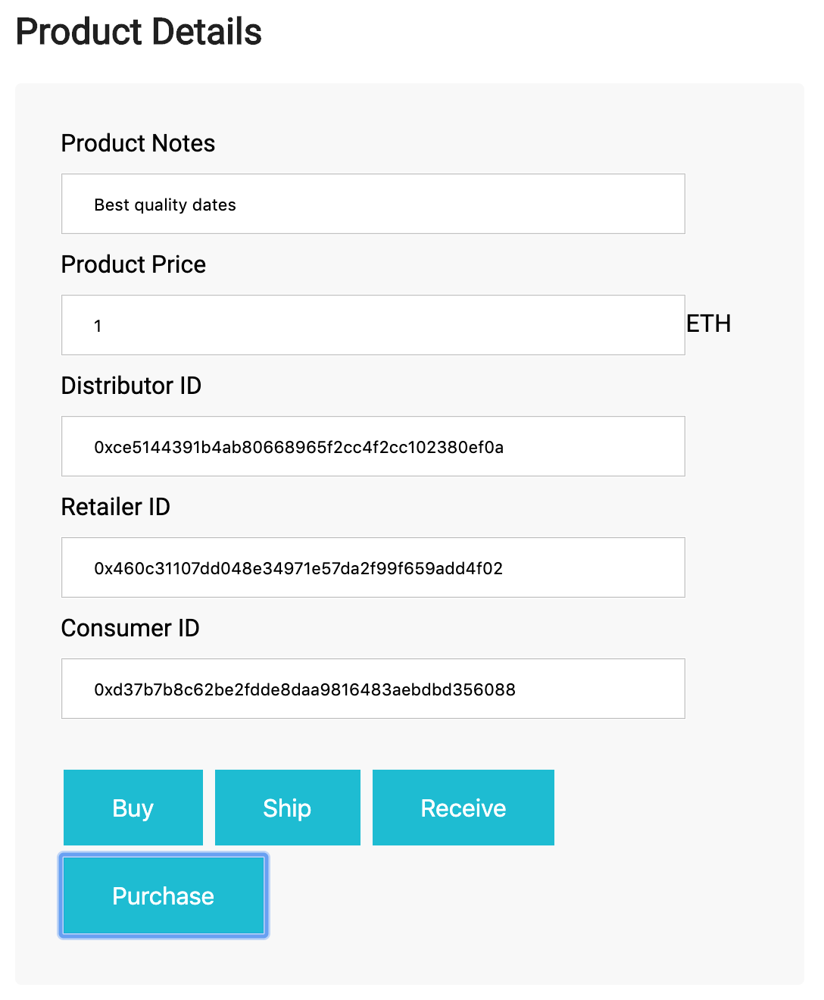
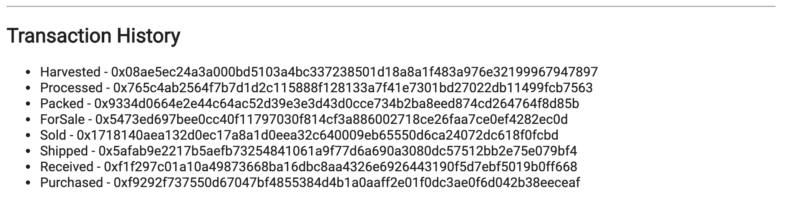

#Project 6 (8B): Ethereum DApp for Tracking Items through Supply Chain

In this project I implemented Dates supply chain management tracking DApp using Ethereum. The tracking starts from the Farmer who harvests the dates and it ends in the final Consumer level through Distributors and Retailer. The farmer can harvers, process, pack, and add the dates items. Distributors can sell and ship these items to retailers. Consumers can purchase these items.


## Required UML diagrams

The design/plan of the DApp includes the below UML digrams:.

### Activity diagram



### Sequence diagram



### State diagram



### Classes diagram



## Setup Project for Review

To setup the project for review.
1. Download/Clone the Project.
2. Install ganache-cli if not installed.
3. Install Truffle if not installed.
4. Install MetaMask extension in the browser if not installed. (Make sure it is enabled)
5. Install all dependencies (npm packages).
```
npm install
```
6. Start ganache.
```
ganache-cli -m "spirit supply whale amount human item harsh scare congress discover talent hamster"
```
7. Make note of the differnt accounts and private keys.
8. Compile the smart contracts in another terminal window. For the compilation to work I configured compilers object in truffle.js file.

```
truffle compile
```
```
compilers : {
    solc: {
      version: "^0.4.24"
    }
  }
```
9. After compilation completes, migrate/deploy the smart contracts locally:

```
truffle migrate
```

10. Test the smart contracts:

```
truffle test
```

11. Make sure the 10 tests should pass.
12. Launch the DApp in a new terminal window:

```
npm run dev
```
## Testing the DApp in the browser

1. Go to [http://localhost:3000/](http://localhost:3000/) to open the DApp in the browser:
2. Test the differnt available functions in the DApp and notice the transaction history.

```
Harvested - 0x08ae5ec24a3a000bd5103a4bc337238501d18a8a1f483a976e32199967947897
Processed - 0x765c4ab2564f7b7d1d2c115888f128133a7f41e7301bd27022db11499fcb7563
Packed - 0x9334d0664e2e44c64ac52d39e3e3d43d0cce734b2ba8eed874cd264764f8d85b
ForSale - 0x5473ed697bee0cc40f11797030f814cf3a886002718ce26faa7ce0ef4282ec0d
Sold - 0x1718140aea132d0ec17a8a1d0eea32c640009eb65550d6ca24072dc618f0fcbd
Shipped - 0x5afab9e2217b5aefb73254841061a9f77d6a690a3080dc57512bb2e75e079bf4
Received - 0xf1f297c01a10a49873668ba16dbc8aa4326e6926443190f5d7ebf5019b0ff668
Purchased - 0xf9292f737550d67047bf4855384d4b1a0aaff2e01f0dc3ae0f6d042b38eeceaf
```
3. DApp Should look like below:









## I deployed the smart contract on (Rinkeby)

The smart contract is deployed on the Ethereum Rinkeby test network:
* Transaction ID: 0x828b8dbfe92d481aa410ff8c7504b879bc50c84a58dd1f873376a53ad5efa6b8
* Contract address: 0x3a5f4717875496B050911df75d6428C5cF440482

```
askariam project-6
$ truffle migrate --network rinkeby

Compiling your contracts...
===========================
> Everything is up to date, there is nothing to compile.


Migrations dry-run (simulation)
===============================
> Network name:    'rinkeby-fork'
> Network id:      4
> Block gas limit: 0x6e864e


2_deploy_contracts.js
=====================

   Deploying 'SupplyChain'
   -----------------------
   > block number:        4785802
   > block timestamp:     1563916945
   > account:             0x137EB8DEC479a6D66B6d7868315956EfAf12aAc1
   > balance:             18.488156450005
   > gas used:            3884725
   > gas price:           2 gwei
   > value sent:          0 ETH
   > total cost:          0.00776945 ETH

   -------------------------------------
   > Total cost:          0.00776945 ETH


Summary
=======
> Total deployments:   1
> Final cost:          0.00776945 ETH


Starting migrations...
======================
> Network name:    'rinkeby'
> Network id:      4
> Block gas limit: 0x6e4d19


2_deploy_contracts.js
=====================

   Deploying 'SupplyChain'
   -----------------------
   > transaction hash:    0x828b8dbfe92d481aa410ff8c7504b879bc50c84a58dd1f873376a53ad5efa6b8
   > Blocks: 1            Seconds: 13
   > contract address:    0x3a5f4717875496B050911df75d6428C5cF440482
   > block number:        4785805
   > block timestamp:     1563916990
   > account:             0x137EB8DEC479a6D66B6d7868315956EfAf12aAc1
   > balance:             18.415831400005
   > gas used:            4004725
   > gas price:           20 gwei
   > value sent:          0 ETH
   > total cost:          0.0800945 ETH


   > Saving migration to chain.
   > Saving artifacts
   -------------------------------------
   > Total cost:           0.0800945 ETH


Summary
=======
> Total deployments:   1
> Final cost:          0.0800945 ETH

askariam project-6
```

You can [view the contract in Etherscan](https://rinkeby.etherscan.io/address/0x3a5f4717875496b050911df75d6428c5cf440482).


## Versions

* Truffle v5.0.19 (core: 5.0.19)
* Node v10.15.3
* Web3 v1.0.0-beta.37
* Solidity v0.4.24 (solc-js)
* Ganache CLI v6.4.3 (ganache-core: 2.5.5)

